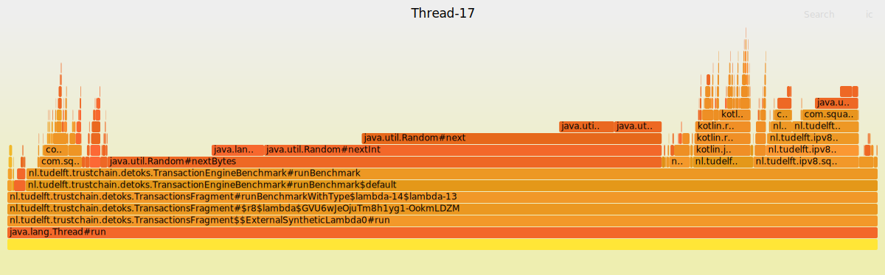

# Detox App
Detox is a decentralized app designed to offer a TikTok-like experience. 

## Transaction API
The app uses tokens to keep track of a user's video seeding and leeching activities.
To enable token exchange between users and maintain transaction records, we have created an API that contains the following API functions:
- `sendTokenTransaction`: Sends a token transaction (amount of tokens) to a peer
- `broadcastTokenTransaction`: Broadcasts a token transaction to all known peers

### Performance Analysis of our `TransactionEngine`
To optimize transaction processing and identify performance bottlenecks, we added a benchmarking button (`TRANSACTIONS`) to the app and introduced the `TransactionEngineBenchmark` class for running benchmarks.

The `TransactionEngineBenchmark` class contains a series of functions.
Each member function of the `TransactionEngineBenchmark` class contains a number of benchmarks, starting with simple unencrypted block creation and increasing in complexity up until the Trustchain stack.

By building up the functionality of the app's transaction processing capabilities, we were able to identify and optimize specific parts of a transaction that are causing performance issues.
Flame graphs were generated using these functions to help us to visualize and isolate performance bottlenecks for further optimization.

We analyzed the performance of the Transaction Engine through a number of benchmarks, analysing the bottlenecks by using Brendan's Gregg tool, `flamegraphs`. Below, we list the different benchmarks:   
 * creating unencrypted basic blocks with the same content (payload and addresses)  
 * creating unencrypted basic blocks with random content (payload and addresses)  
 * creating unencrypted signed blocks with random content (payload and addresses)
 * creating unencrypted signed blocks with random content (payload and addresses) and in-memory storage
 * creating unencrypted signed blocks with random content (payload and addresses) and permanent storage  
 * creating and sending encrypted random content blocks through IPv8
 * creating, sending and counterparty-replying encrypted random content blocks through Trustchain

### Flame Graph Layers
Let us look at a number of flamegraphs and identify the bottlenecks:  
 
#### Creating unencrypted basic blocks with the same content
speed : 20 to 50 microseconds  

we can  see in the flamegraph below that this function is mostly bottlenecked by internal class generation, but nothing major  
 

#### Creating unencrypted basic blocks with random content

speed: range 30 to 50 microseconds    
here, we can see that the function is bottlenecked mostly by the "random" filling of the content. this could be further optimized by changing the random generation to a more optimized function for pseudo-random generation, like reading random bytes from a file.    
   

#### Creating unencrypted signed blocks with random content

speed: range 50 to 100 microseconds   
doesn't change much than from the non-signed block, the biggest bottleneck stays the "random aspect"   
   

#### Creating unencrypted signed blocks with random content and permanent storage

here we finally see some difference.  
the speed is in the range 300 to 600 microseconds (large increase).  
we can see in the flamegraph below that the bottleneck here are the function linked to trustchain. First, the building of the block by TrustchainBuilder, which corresponds to about 25% of the runtime. Furthermore, the storing on the trustchain takes up 42% of the runtime. This makes sense, and there isn't much to be optimized here except eventually taking a deep down down the implementation of the trustchain core to see if there are any sub-optimal functions  

   

#### Creating and sending encrypted random content blocks through IPv8

this is the end result in which we are most interested in, as it's the "final boss" of the different functions we have implemented.    
the runtime is in the range 400 - 800 microseconds.  this would allow for a theoretical ~1400 blocks sent per second, which is above the desired target for this course's scope. 
Similar to the permanently stored block, the principal bottleneck resides in the block generation and signature. Additionaly, the block sending through ipv8 adds an additional delay which corresponds to about 20% of the total runtime, explaining the increase in runtime compared to the simple block creation.  
Below: the flamegraph: 

## Usage Instructions
The app features a `Transactions` button on the main screen, which takes the users to a new screen where they can:
- see a list of all peers in the `DeToksCommunity`
- run different benchmarks themselves
- view an intuitive graph for each benchmark
